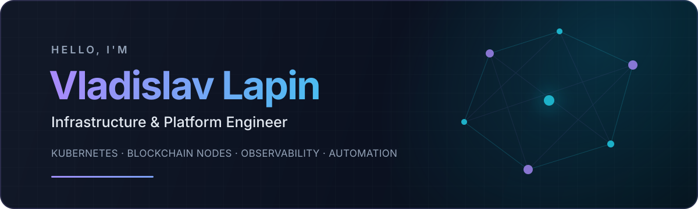

<p align="center">
  
</p>

<p align="center">
  <a href="https://github.com/loglapa?tab=followers"></a>
  <a href="https://github.com/loglapa"></a>
</p>

## Hi, I'm Vladislav 👋

I design, deploy, and operate **Kubernetes platforms** across bare metal, virtual machines, and orchestrated environments. I also run **blockchain node infrastructure** on bare metal and in containerized configurations.

My work covers the full operational lifecycle: architecture, rollout, upgrades, storage and network tuning, observability, incident response, and delivery automation. I like systems that remain understandable under pressure and routine operations that are safe to repeat.

- ☸️ Building and operating **Kubernetes clusters**, workloads, and supporting platform services
- ⛓️ Running **blockchain nodes** in different roles, topologies, and deployment configurations
- 🔄 Planning upgrades, migrations, recovery procedures, and zero-surprise maintenance
- 📈 Engineering observability with **Grafana, Prometheus, VictoriaMetrics, and alerting**
- 🔧 Automating infrastructure and delivery with **GitLab CI/CD, Ansible, Bash, and containers**
- 🌐 Supporting production networking with **NGINX, DNS, TLS, and Cloudflare**
- 🤖 Using AI-assisted engineering to shorten the path from incident to durable fix

## Toolbox

<p>
  
  
  
  
  
  
  
  
  
  
  
  
</p>

## Current focus

```text
Kubernetes platforms  ──  blockchain infrastructure  ──  observability
         │                           │                         │
 cluster lifecycle            node operations           metrics & alerts
 rollouts & upgrades       multi-role topologies       incident response
```

My public repositories reflect current hands-on work with node software and tooling across ecosystems such as **Aztec, Celestia, and XDC**, alongside the **Grafana and Prometheus** observability stack.

## GitHub activity

<p align="center">
  
  
</p>

<p align="center">
  <sub>Infrastructure should be understandable, reproducible, and calm.</sub>
</p>
